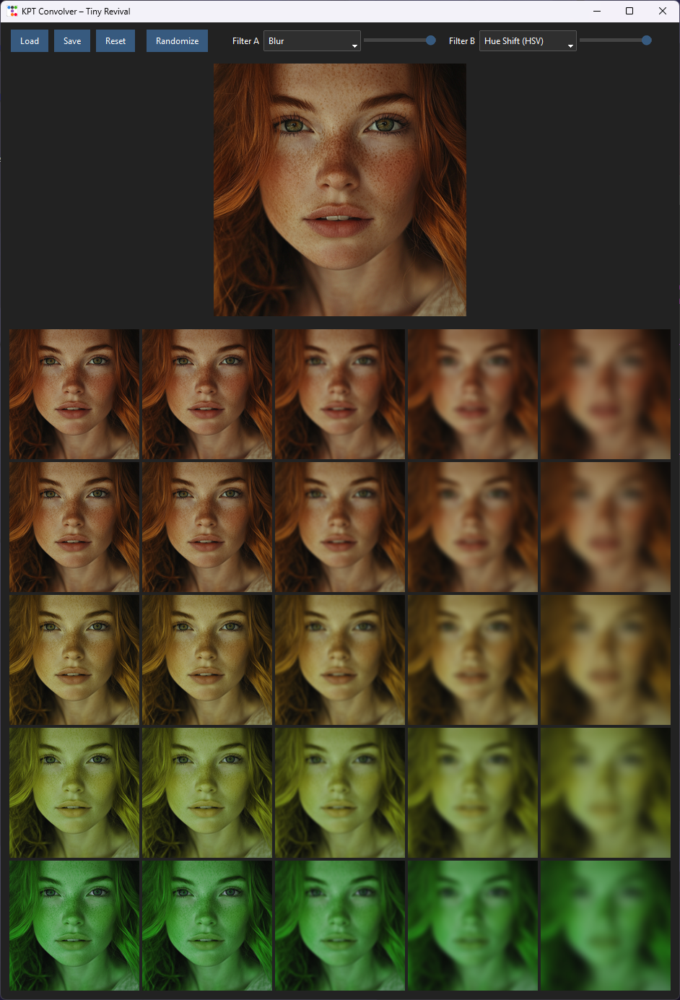

# KPT Evolver – Tiny Revival


A small experimental image exploration tool inspired by the original **Kai’s Power Tools (KPT) Convolver**.

This is **not** an image editor in the traditional sense.  
It is a **design-space exploration tool**: instead of tweaking sliders, you explore a grid of variations, pick one, and iterate.

Think **evolution**, not adjustment.

## Download

👉 **Windows or MacOS build:**  
Download the latest executable from the  
[Releases page](../../releases)

---
<p align="center">
  
  <br>
  <em>Grid-based exploration with two filters</em>
</p>

## What it does

- Loads a seed image
- Applies **two image filters** (A and B)
- Generates a **grid of variations**
  - X-axis = Filter A strength
  - Y-axis = Filter B strength
- You **click one tile** to make it the new seed
- Repeat indefinitely

This creates a fast, intuitive way to explore visual possibilities without committing to exact parameter values.

---

## Core concepts

- **Grid > sliders**  
  You explore *spaces*, not values.

- **Human-guided evolution**  
  The user’s choice is the fitness function.

- **Bounded exploration**  
  Filters have safe ranges and neutral values to avoid dead ends (black / gray collapse).

- **Deliberately simple UI**  
  No layers, no history stack, no presets.

---

## Features

- Two selectable filters (Filter A / Filter B)
- 5-step discrete strength sliders (20% → 100%)
- Correct handling of neutral values (e.g. contrast, brightness, gamma)
- Original image preview
- Load image at any time
- Save current evolved image
- Auto-loads a default image on startup (configurable)

---

## Filters included

- Blur  
- Hue Shift (HSV)
- Contrast
- Brightness
- Saturation
- Sharpen
- Unsharpen
- Gamma
- Solarize

Each filter defines:
- its usable range
- its neutral (no-effect) value

This keeps evolution stable across many generations.

---

## Requirements

- Python 3.9+
- Pillow

Install dependencies:

```bash
pip install pillow numpy ttkbootstrap
